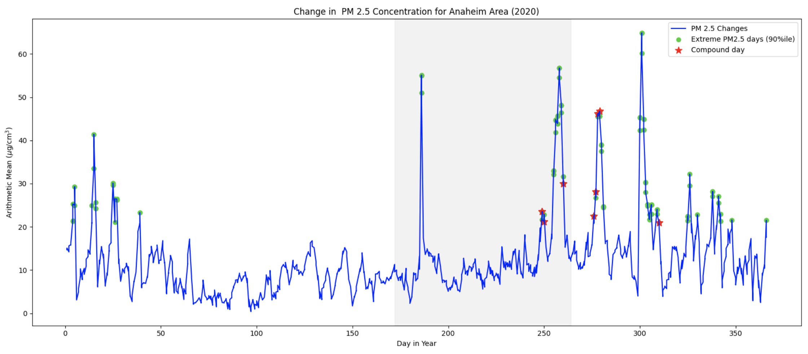

# Mapping Extreme Temperature and PM2.5 Concentration Coextremes Across California
It is well known in the scientific community that exposure to either extreme heat or extreme concetrations of pollutants (such as PM 2.5) can pose severe health risks. However, new evidence is emerging that may suggest that the simultanous expoisure of both these conditions may create a synergestic effect where the harmful effects of both can be augmented. This notebook attempts to map the number of these compound days across the state of California, to see how the prevalence of these harmful conditions have changed over time.

# Methodology
The U.S. EPA Air Quality Database was used to map out the distribution of both extreme heat and PM2.5 conditions. A total of __ sensors were utilized and graphed in total. 

The "Average Ambient Temperature" parameter was used to determine extreme temperature days, however the "Outdoor Temperature" parameter was used in its place when the former could not be found. To my knowledge, there is no publicly available documentation which discusses the difference between the two. "Average PM2.5 Concentration" parameter was used to determine PM2.5 values.

In this experiment, an "extreme" day is one where the value of at least one parameter falls within the 90th percentile of that year. A "co-extreme" day is one where both temperature and PM2.5 concentration values fall within the 90th percentile. (These are indicated with a red star.)

# Results
A variety of the maps were created such as the one below. 

An important note is that while the number of compound days on average increases as time goes on, the number of avaialable sensors for data collection also increased in that time period, os while it may be possible that there has been an increase in co-extreme days over the past quarter century, it is not safe to conclude so based on this evidence alone.
